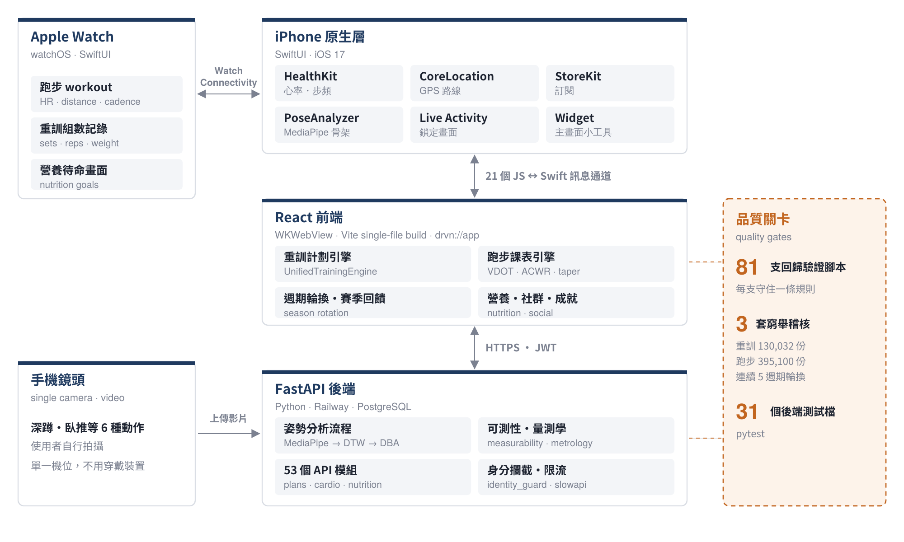

# DRVN：單鏡頭動作分析與訓練系統

**陳冠甫 GuanFu Chen**｜國立中央大學 生醫科學與工程學系｜mikechen8918@gmail.com

DRVN 從我的畢業專題延伸而來：專題是用一支手機鏡頭比對使用者和教練的動作，並驗證這套分析的能力邊界。之後我把它做成完整的 App，包含 iPhone、Apple Watch、網頁前端和雲端後端，再加上重訓、跑步、營養三個訓練系統。

> 這個 repo 是給審閱用的**精選版本**。完整的開發 repo 是私人的，這裡沒有放：受試者影片與實驗原始資料、圖片素材、建置產物、環境變數與金鑰，以及開發過程中的報告。因為拿掉了圖片素材，前端無法直接 build；但下面提到的稽核腳本都可以直接執行。



資料流程圖：[`docs/flows/`](docs/flows/)

---

## 建議從這三個地方看

### 1. 姿勢比對與能力邊界（畢業專題）

**問題**：居家健身 App 多半只給分數，卻不說這個機位到底量不量得到。拍不到的錯誤，系統照樣給出「看起來正常」的分數。

**做法**：
- MediaPipe 取出 33 點骨架，算成 7 項指標（角度或無因次比值，跟身高無關）。
- 用 DTW 對齊使用者和教練的節奏，否則「做得比較慢」會被當成「姿勢不對」。28.9° 的逐幀差異中，真正的姿勢差只有 2.5°。
- 用 DBA 把教練的多次示範合成各機位的模板，以教練自己每次動作之間的差異當評分的尺。只對事先宣告的錯誤方向扣分。

**驗證**：以「可測性 → 信度 → 辨識效度」三階段逐一檢驗每個機位能抓到哪些錯誤，例如：
- 深蹲膝內夾只有正面 0° 抓得到（指標下降 50 分）。
- 臥推手肘外開以正上方俯視最敏感（下降 68 分）。

App 分析前會先告訴使用者，這個機位量得到哪些指標。

**過程中修掉的兩個問題**（寫在模組開頭的說明裡）：
- `measurability.py`：實驗發現「側面機位」旗標在 16 支影片裡全部是 false，側面的判斷整段從沒執行過。另外，臥推手肘外開在正側面機位只變了 0.86°，量到的其實是單目深度的雜訊。我把二元旗標改成「機位 × 解剖平面」的可測性查表。
- `metrology.py`：不再只比分數，改成直接檢查量測值本身：骨長是否恆定、左右是否對稱、相機方位、逐軸雜訊。這樣才找出某次鑑別度從 1.26 掉到 0.06，是因為評分的尺只用 2 支影片估出來。

| 檔案 | 內容 |
|---|---|
| `backend/core/multi_exercise.py` | 骨架擷取、指標計算、DTW 對齊、DBA 模板、評分 |
| `backend/core/measurability.py` | 機位 × 指標的可測性查表 |
| `backend/core/metrology.py` | 不需真值的量測品質檢查 |
| `backend/api_pose_analysis.py` | 影片上傳與分析 API |
| `ios/App/PoseAnalyzer.swift`、`PoseFeatureExtractors.swift` | 把骨架偵測搬到手機端（進行中） |
| `research/` | 機位角度估計、平面族分析、海報圖表 |
| `docs/poster_graduation_project.pdf` | 專題海報（生醫系畢業專題海報競賽第一名，共 30 組） |

### 2. 訓練計劃引擎與窮舉稽核

**問題**：課表產生器的輸入組合有十幾萬種，靠手動點幾組測不出問題。

**做法**：先把「教練會不會把這份課表交給學生」寫成可檢查的標準，再寫程式把每一種畫面選得到的組合都生成出來逐份檢查。違反標準的分成硬傷（不能交出去）和警告兩類。
- 重訓標準：[`PLAN_CHECK_STANDARD.md`](docs/standards/PLAN_CHECK_STANDARD.md)，依 NSCA 漸進原則與 Schoenfeld 的訓練量研究。
- 跑步標準：[`RUN_PLAN_STANDARD.md`](docs/standards/RUN_PLAN_STANDARD.md)，依 Daniels VDOT 配速、Gabbett ACWR 負荷比、Mujika 減量。
- 週期輪換：[`CYCLE_ROTATION_STANDARD.md`](docs/standards/CYCLE_ROTATION_STANDARD.md)，模擬使用者連續練 5 個週期、各種完成度與自覺強度回饋。

**結果**：畫面選得到的組合，硬傷都是 0。抓到並修掉的問題包括：
- 新手被排到引體向上。
- 上半身日混進腿部動作。
- 胸背重點的週訓練量不夠。
- 減量週完全沒有強度刺激。

```bash
cd frontend
npm install
node scripts/audit_plans.mjs              # 重訓：130,032 份課表 × 4 週，約 3 分鐘
node scripts/audit_run_plans.mjs --full   # 跑步：395,100 份課表
node scripts/audit_cycle_rotation.mjs     # 週期輪換：連續 5 個週期
```

主要程式：`frontend/src/utils/UnifiedTrainingEngine.js`（重訓）、`cardioPlanFusionEngine.js`（跑步）、`seasonTransition.js`（週期輪換）。另有 81 支 `frontend/scripts/verify_*.mjs`，每支守住一條規則，例如不顯示捏造的數據、新使用者沒有預設的身體數值。

### 3. 手錶資料流與後端資安

- **iPhone ↔ Apple Watch**：`ios/App/WatchConnectivityManager.swift`、`ios/Watch/WatchConnHub.swift`。手錶跑步時用 HealthKit 的即時 workout 取得心率、步頻、距離，同步回手機。
- **網頁 ↔ 原生**：`ios/App/WebView.swift` 註冊 21 個 JS ↔ Swift 訊息通道，讓 React 前端能用 HealthKit、GPS、通知、訂閱等原生功能。
- **身分攔截**：`backend/identity_guard.py`。很多 API 把 `user_id` 當一般參數收下，攻擊者換掉 ID 就能變成別人。這支程式在啟動時掃過所有路由，凡是有 `user_id` 參數的，都改用登入憑證（JWT）裡的身分覆蓋。原本「比對右邊來自攻擊者」的假檢查，也因此自動變成真檢查。
- **其他**：
  - 登入端點限流（`rate_limit.py`，在 Railway 代理後面取正確的使用者 IP）。
  - 正式環境偵測到預設的弱密鑰就拒絕啟動（`config.py`）。
  - 計劃已更新時，拒絕舊版本的存檔，回傳 409。

---

## 開發方式與分工

程式大多在 AI 協助下完成。我負責的是：
- 架構與邏輯：每個模組做什麼、資料怎麼流、哪裡可能出錯。
- 實驗設計與驗證方法。
- 上面這些檢查標準和稽核腳本要檢查什麼。

AI 寫出來的東西，我都用這些標準和腳本驗證過才採用。

## 目錄

```
frontend/   React 前端：src/（介面與訓練引擎）、scripts/（稽核與驗證腳本）
backend/    FastAPI 後端：core/（姿勢分析、計劃規則、資料模型）、tests/
ios/        App/（iPhone 原生層）、Watch/（Apple Watch App）、Widget/
research/   專題的分析與圖表腳本
docs/       架構圖、三份檢查標準、專題海報、作品集 PDF
```

© 2026 陳冠甫。僅供審閱，未授權重製或商業使用。
